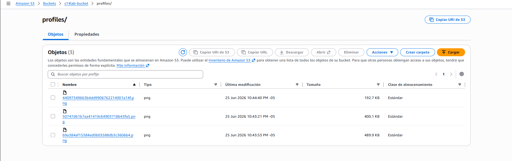
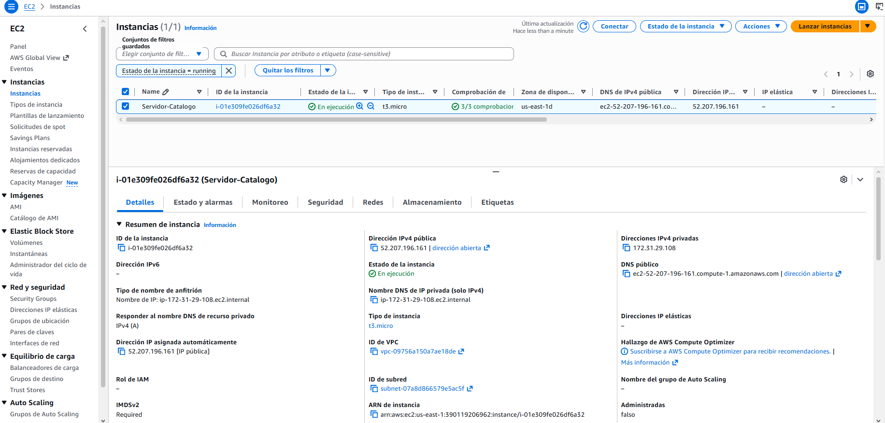
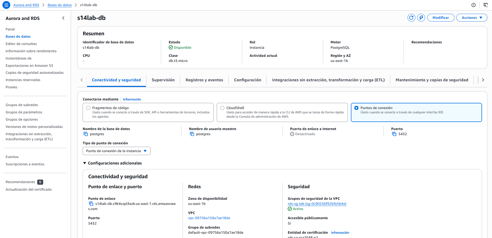
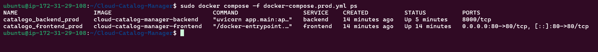
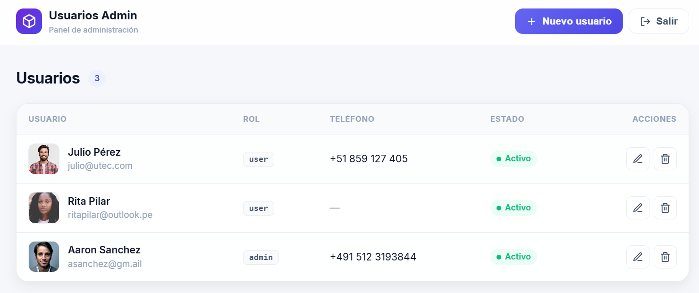

# Sistema de Gestión de Usuarios (Admin)

**Alumna:** Kiara Alexandra Balcázar Santa Cruz
**Código:** 202210403
**Curso:** Introducción a Cognitive Computing (EL3302)

---

Aplicación web de **3 capas** con perfil de administrador para **gestionar usuarios**
(crear, consultar, actualizar y eliminar), desarrollada para el curso
**Introducción a Cognitive Computing (EL3302)**.

- **Frontend:** React + Vite (SPA)
- **Backend:** FastAPI (Python) con autenticación JWT
- **Base de datos:** PostgreSQL (contenedor en local / **RDS** en producción)
- **Almacenamiento de imágenes:** AWS S3 (vía `boto3`)
- **Orquestación:** Docker Compose
- **Despliegue:** EC2 (AWS)

El perfil **Admin** se autentica (JWT) y realiza el **CRUD** completo de usuarios
(crear, listar, editar, eliminar), incluyendo la subida de la **foto de perfil**
del usuario a **Amazon S3**.

---

## 1. Arquitectura

```
┌──────────────┐      HTTP/JWT       ┌──────────────┐      SQL        ┌──────────────┐
│   Frontend   │  ───────────────▶   │   Backend    │  ───────────▶   │  PostgreSQL  │
│ React + Vite │   /api (axios)      │   FastAPI    │   SQLAlchemy    │  (RDS/local) │
└──────────────┘                     └──────┬───────┘                 └──────────────┘
                                            │ boto3
                                            ▼
                                      ┌──────────────┐
                                      │   AWS  S3    │  (fotos de perfil de usuarios)
                                      └──────────────┘
```

En **producción**, Nginx sirve el frontend estático y hace *reverse-proxy* de `/api`
hacia el backend, por lo que el navegador usa **rutas relativas** y no depende de la
IP pública de EC2.

---

## 2. Estructura del proyecto

```
s14lab/
├── docker-compose.yml          # Desarrollo (db + backend + frontend con hot-reload)
├── docker-compose.prod.yml     # Producción (backend + frontend Nginx; DB = RDS)
├── .env.example                # Plantilla de variables (copiar a .env)
├── .gitignore
│
├── backend/
│   ├── Dockerfile
│   ├── requirements.txt
│   └── app/
│       ├── main.py             # FastAPI: crea tablas, seed admin, monta routers
│       ├── config.py           # Settings (pydantic-settings, lee .env)
│       ├── database.py         # Engine + sesión SQLAlchemy
│       ├── models.py           # ORM: User (administrable), AdminUser (login)
│       ├── schemas.py          # Schemas Pydantic
│       ├── auth.py             # Hashing bcrypt + JWT + dependencia get_current_admin
│       ├── s3.py               # Upload de fotos de perfil a S3 (boto3)
│       ├── seed.py             # Seed idempotente del usuario admin
│       └── routers/
│           ├── auth_router.py      # POST /api/auth/login
│           └── users_router.py     # CRUD /api/users
│
└── frontend/
    ├── Dockerfile              # Producción: multi-stage (build Node + Nginx)
    ├── Dockerfile.dev          # Desarrollo: vite --host (hot-reload)
    ├── nginx.conf              # SPA fallback + proxy /api -> backend
    ├── package.json
    ├── vite.config.js
    ├── index.html
    └── src/
        ├── main.jsx            # Router + AuthProvider
        ├── App.jsx             # Definición de rutas
        ├── styles.css
        ├── api/client.js       # axios + interceptores (token, 401)
        ├── context/AuthContext.jsx
        ├── components/ProtectedRoute.jsx
        └── pages/
            ├── Login.jsx
            ├── Dashboard.jsx       # Lista de usuarios + eliminar
            └── UserForm.jsx        # Crear / editar + upload foto de perfil
```

---

## 3. Requisitos previos

- **Docker** y **Docker Compose** (v2)
- Una cuenta de **AWS** con:
  - Un **bucket S3** creado (acceso público de lectura para mostrar las imágenes)
  - Las **credenciales** (Access Key, Secret Key y **Session Token**)

---

## 4. Configuración (`.env`)

1. Copia la plantilla:

   ```bash
   cp .env.example .env
   ```

2. Edita `.env` y completa:

   | Variable | Descripción |
   |---|---|
   | `AWS_ACCESS_KEY_ID` / `AWS_SECRET_ACCESS_KEY` / `AWS_SESSION_TOKEN` | Credenciales de AWS (los 3) |
   | `AWS_REGION` | Región del bucket (p. ej. `us-east-1`) |
   | `S3_BUCKET_NAME` | Nombre exacto del bucket S3 |
   | `DATABASE_URL` | Conexión a Postgres. Local: `postgresql://admin:admin123@db:5432/catalogo`. Prod (RDS): endpoint del RDS |
   | `JWT_SECRET` | Clave secreta para firmar los JWT |
   | `POSTGRES_USER` / `POSTGRES_PASSWORD` / `POSTGRES_DB` | Deben **coincidir** con `DATABASE_URL` (solo dev) |
   | `VITE_API_URL` | Dev: `http://localhost:8000`. Prod: dejar vacío |
   | `ADMIN_USERNAME` / `ADMIN_PASSWORD` | Credenciales del admin que se siembra al arrancar |

> El archivo `.env` **no se commitea** (está en `.gitignore`). Solo se versiona `.env.example`.

---

## 5. Ejecución en desarrollo (local)

```bash
docker compose up --build
```

Esto levanta 3 contenedores:

| Servicio | URL | Notas |
|---|---|---|
| `frontend` | http://localhost:5173 | Vite con hot-reload |
| `backend`  | http://localhost:8000 | API + docs en `/docs` |
| `db`       | localhost:5432 | PostgreSQL (volumen `pgdata`) |

Al arrancar, el backend **crea las tablas** y **siembra el usuario admin**
(`ADMIN_USERNAME` / `ADMIN_PASSWORD`).

**Uso:**

1. Abre http://localhost:5173
2. Inicia sesión con el usuario admin (por defecto `admin` / `admin123`)
3. Crea, edita y elimina usuarios. Al subir una foto de perfil, esta va a **S3** y se
   guarda su URL en la base de datos.

Para detener:

```bash
docker compose down          # conserva los datos (volumen)
docker compose down -v       # elimina también el volumen de Postgres
```

---

## 6. API (resumen)

Documentación interactiva: **http://localhost:8000/docs**

| Método | Ruta | Auth | Descripción |
|---|---|---|---|
| `GET`  | `/health` | — | Estado del servicio |
| `POST` | `/api/auth/login` | — | Login (form-data `username`, `password`) → JWT |
| `GET`  | `/api/users/` | JWT | Listar usuarios |
| `GET`  | `/api/users/{id}` | JWT | Obtener un usuario |
| `POST` | `/api/users/` | JWT | Crear (multipart: `name`, `email`, `role`, `status`, `phone?`, `image?`) |
| `PUT`  | `/api/users/{id}` | JWT | Actualizar (campos opcionales + `image?`) |
| `DELETE` | `/api/users/{id}` | JWT | Eliminar |

Las rutas protegidas requieren la cabecera `Authorization: Bearer <token>`.

**Modelo `User`:** `id`, `name`, `email` (único), `role` (`admin`/`user`),
`status` (`activo`/`inactivo`), `phone`, `profile_image_url`.
La imagen (`image`) se sube a S3 con prefijo `profiles/` y se guarda en `profile_image_url`.

---

## 7. Despliegue en producción (EC2 + RDS)

### 7.1. Preparar AWS (consola)

1. **RDS PostgreSQL:** crea una instancia y anota el *endpoint*, usuario y contraseña.
2. **S3:** crea el bucket y habilita lectura pública de objetos (para mostrar imágenes).
3. **EC2:** lanza una instancia (Amazon Linux 2023 / Ubuntu) con un **Security Group**
   que permita entrada en:
   - **80** (HTTP, frontend) desde `0.0.0.0/0`
   - **22** (SSH) desde tu IP
   - El RDS debe permitir **5432** desde el Security Group de la EC2.

### 7.2. Instalar Docker en la EC2

```bash
sudo yum install -y docker        # (Amazon Linux)   o  sudo apt install -y docker.io
sudo systemctl enable --now docker
sudo usermod -aG docker $USER     # reconecta la sesión SSH tras esto
# Docker Compose v2 (plugin):
sudo curl -SL https://github.com/docker/compose/releases/latest/download/docker-compose-linux-x86_64 \
  -o /usr/libexec/docker/cli-plugins/docker-compose
sudo chmod +x /usr/libexec/docker/cli-plugins/docker-compose
```

### 7.3. Desplegar

```bash
git clone <repo> && cd s14lab
cp .env.example .env
# Edita .env:
#  - DATABASE_URL  -> endpoint del RDS
#  - AWS_*         -> credenciales temporales (las 3, incluido el token)
#  - S3_BUCKET_NAME
#  - VITE_API_URL  -> dejar VACÍO (el frontend usa /api y nginx proxya)

docker compose -f docker-compose.prod.yml up -d --build
```

Accede en `http://<IP-PÚBLICA-EC2>/`.

---

## 8. Notas de seguridad

- `.env` con secretos reales **nunca** se sube al repositorio.
- En producción conviene restringir `allow_origins` del CORS (hoy abierto para el lab)
  y usar HTTPS (p. ej. con un reverse-proxy / certificado).

---

## 10. Evidencias (capturas)

### AWS
<!-- SCREENSHOT: AWS S3 — bucket con las fotos de perfil (prefijo profiles/) -->


<!-- SCREENSHOT: AWS EC2 — instancia en estado running (IP pública) -->


<!-- SCREENSHOT: AWS RDS — endpoint de la base de datos PostgreSQL -->


### Docker
<!-- SCREENSHOT: docker compose ps — contenedores up en la EC2 -->


<!-- SCREENSHOT: aplicación funcionando en http://<IP-PÚBLICA-EC2> -->


[Enlace a video (excedía 150 MB)](https://drive.google.com/drive/folders/1BRlbtIGj9RpI2YTDvFAeTKU0-HZXfdK9?usp=sharing)
